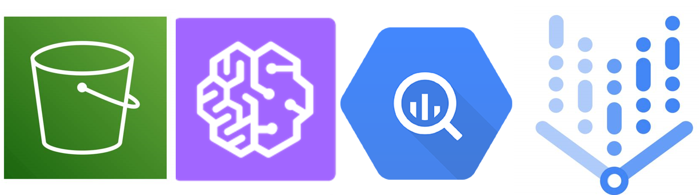

# Credit_Risk-Cloud-tools-
A very fast credit rating good/bad classification project mainly for practice for AWS(S3 and SageMaker) and Google Cloud(BigQuery and VertexAI instances).

  

### Chapters
##### Data exploration: Data cleaning (already clean), analyse relationships, choose predictive variables for the ML models. 
##### Logistic Regression: The simplest possible solution with mediocre results.
##### Random Forest: A more sophisticated solution but with disapointing results.
##### XGBoost: A less easily explainable model but with satisfactory results.

### Tools
Load data to S3 bucket or as a BigQuery Table. The pull to the develpoment enviroments SageMaker for S3 in a new Domain as a ML workflow and VertexAI for BigQuery as a new instance python notebook.
